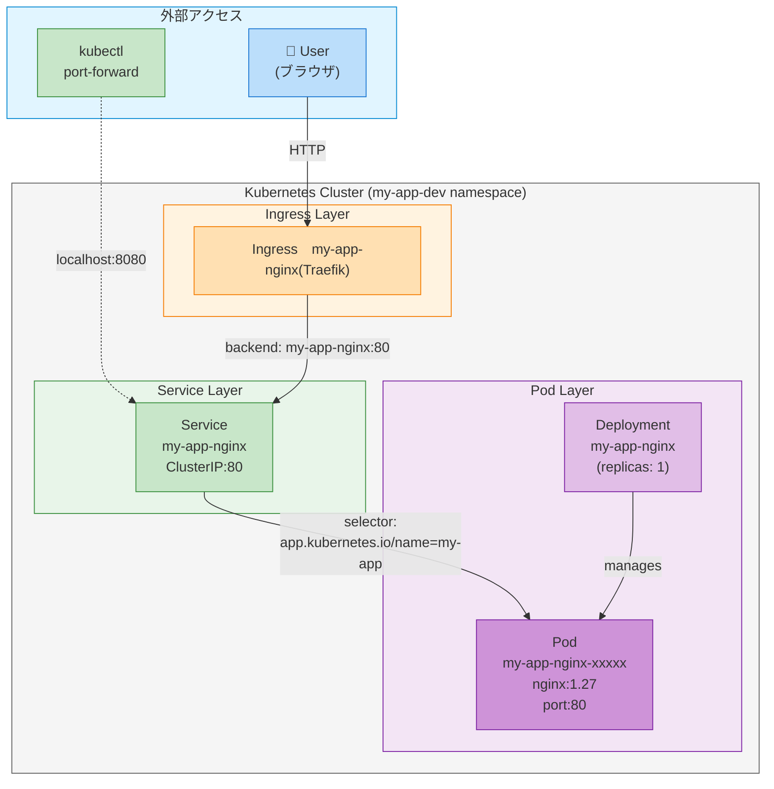

# My App

## プロジェクト概要

このプロジェクトは、Kubernetesの基本的なリソース構成を学習するためのシンプルなWebアプリケーションです。
Nginxコンテナを使用したDeployment、Service、Ingressを含むKustomizeベースの構成例となっています。

### 主要コンポーネント

- **Nginx**: Webサーバー（バージョン1.27、デフォルトページを配信）
- **Service**: ClusterIP型のService
- **Ingress**: HTTPアクセスのルーティング

---

## システム・ネットワーク構成図



### アクセスフロー

1. **Ingress経由**: User → Ingress (Traefik) → Service → Pod
2. **Port Forward経由**: kubectl port-forward → Service → Pod

### リソース間の関係

- **Deployment**: Podのライフサイクルを管理（レプリカ数、ローリングアップデートなど）
- **Service**: Podへの安定したアクセスポイントを提供（ClusterIP）
- **Ingress**: 外部からのHTTPトラフィックをServiceにルーティング

---

## スタート・ストップ方法

### 起動

```bash
# my-app環境をデプロイ
kubectl apply -k apps/my-app/overlays/dev
```

### 停止

```bash
# 全リソースを削除
kubectl delete -k apps/my-app/overlays/dev
```

または

```bash
# namespaceごと削除
kubectl delete namespace my-app-dev
```

### 再起動（設定変更後）

```bash
# 変更を適用
kubectl apply -k apps/my-app/overlays/dev

# Podを再起動（必要な場合）
kubectl rollout restart deployment/my-app-nginx -n my-app-dev
```

---

## Podの状態確認

### 全リソース一覧

```bash
kubectl get all -n my-app-dev
```

### Pod状態の確認

```bash
# Pod一覧
kubectl get pods -n my-app-dev

# 詳細情報
kubectl describe pod -n my-app-dev -l app.kubernetes.io/name=my-app

# ログ確認
kubectl logs -n my-app-dev deployment/my-app-nginx --tail=50
```

### Service/Ingress確認

```bash
# Service情報
kubectl get svc -n my-app-dev

# Ingress情報
kubectl get ingress -n my-app-dev

# Service詳細
kubectl describe svc -n my-app-dev
```

---

## Webアプリケーションへのアクセス方法

### ポートフォワード（推奨）

**最もシンプルで確実なアクセス方法:**

```bash
# ポートフォワード開始
kubectl port-forward -n my-app-dev svc/my-app-nginx 8080:80

# ブラウザでアクセス
# → http://localhost:8080
```

### Ingress経由

Ingress設定がある場合、Ingress Controllerを通じてアクセス可能です。

```bash
# Ingress設定の確認
kubectl get ingress -n my-app-dev -o yaml
```

---

## ファイル構成と実行環境への反映

### ディレクトリ構造

```
apps/my-app/
├── README.md
├── base/
│   ├── kustomization.yaml    # Kustomize設定（リソース定義）
│   ├── deployment.yaml        # Nginx Deployment定義
│   ├── service.yaml           # Service定義
│   └── ingress.yaml           # Ingress定義
└── overlays/
    └── dev/
        ├── kustomization.yaml # dev環境設定（namespace指定）
        └── namespace.yaml     # my-app-dev namespace
```

### ファイルと実行環境の対応関係

#### **1. deployment.yaml → Nginx Pod**

```
base/deployment.yaml
  ↓ (kubectl apply with namespace)
Deployment: my-app-nginx
  ↓ (creates Pod)
Pod: my-app-nginx-xxxxx
  ↓ (nginx:1.27 image)
Nginx Webserver on port 80
```

**設定内容:**
- イメージ: `nginx:1.27`
- レプリカ数: 1
- コンテナポート: 80
- ラベル: `app.kubernetes.io/name=my-app`, `app.kubernetes.io/component=web`

#### **2. service.yaml → Service**

```
base/service.yaml
  ↓ (kubectl apply with namespace)
Service: my-app-nginx
  ↓ (selector matches Pod labels)
Pod: my-app-nginx-xxxxx
  ↓ (ClusterIP service)
内部通信とポートフォワードで利用
```

**公開ポート:**
- Service port: 80
- targetPort: 80 (Pod)

#### **3. ingress.yaml → Ingress**

```
base/ingress.yaml
  ↓ (kubectl apply with namespace)
Ingress: my-app-nginx
  ↓ (routing configuration)
Ingress Controller
  ↓ (backend service: my-app-nginx:80)
Pod: my-app-nginx-xxxxx
```

**ルーティング:**
- Path: `/` (Prefix)
- Backend: `my-app-nginx:80`

#### **4. overlays/dev/kustomization.yaml → 環境設定**

```
overlays/dev/kustomization.yaml
  ↓ (base + namespace)
リソース読み込み:
  - baseの全リソース
  - namespace.yaml
  
Namespace設定:
  - my-app-dev
```

**Kustomizeの変換処理:**
- `namespace: my-app-dev` → 全リソースが`my-app-dev`にデプロイ
- baseのリソース名はそのまま使用

---

## トラブルシューティング

### PodがImagePullBackOffになる

```bash
# Pod状態確認
kubectl describe pod -n my-app-dev -l app.kubernetes.io/name=my-app

# イメージが正しいか確認
kubectl get deployment -n my-app-dev my-app-nginx -o jsonpath='{.spec.template.spec.containers[0].image}'
```

### Serviceにアクセスできない

```bash
# Serviceの状態確認
kubectl get svc -n my-app-dev my-app-nginx

# Service詳細確認
kubectl describe svc -n my-app-dev my-app-nginx

# Podが正常に動作しているか確認
kubectl get pods -n my-app-dev
```

### Ingressが機能しない

```bash
# Ingressの状態確認
kubectl describe ingress -n my-app-dev my-app-nginx

# Ingress Controllerが動作しているか確認
kubectl get pods -A | grep ingress
```

---

## 開発ワークフロー

### Deploymentの変更（イメージ、レプリカ数等）

1. `base/deployment.yaml`を編集
2. 変更を適用:
   ```bash
   kubectl apply -k apps/my-app/overlays/dev
   ```
3. ロールアウト状況確認:
   ```bash
   kubectl rollout status deployment/my-app-nginx -n my-app-dev
   ```

### Serviceの変更

1. `base/service.yaml`を編集
2. 変更を適用:
   ```bash
   kubectl apply -k apps/my-app/overlays/dev
   ```

### Ingressの変更

1. `base/ingress.yaml`を編集
2. 変更を適用:
   ```bash
   kubectl apply -k apps/my-app/overlays/dev
   ```

### 環境別の設定追加（例: prod環境）

```bash
# 新しい環境ディレクトリを作成
mkdir -p apps/my-app/overlays/prod
cat <<EOF > apps/my-app/overlays/prod/kustomization.yaml
apiVersion: kustomize.config.k8s.io/v1beta1
kind: Kustomization

namespace: my-app-prod

resources:
- ../../base
- namespace.yaml
EOF

cat <<EOF > apps/my-app/overlays/prod/namespace.yaml
apiVersion: v1
kind: Namespace
metadata:
  name: my-app-prod
EOF

# デプロイ
kubectl apply -k apps/my-app/overlays/prod
```

---

## Kustomizeの動作確認

### ビルド結果のプレビュー

```bash
# Kustomizeを適用した最終的なマニフェストを確認
kubectl kustomize apps/my-app/overlays/dev
```

### 差分確認

```bash
# 現在の状態と新しい設定の差分を表示
kubectl diff -k apps/my-app/overlays/dev
```

---

## 参考情報

- **Kubernetes Documentation**: https://kubernetes.io/docs/
- **Kustomize Documentation**: https://kubectl.docs.kubernetes.io/
- **Nginx Documentation**: https://nginx.org/en/docs/
- **Traefik Documentation**: https://doc.traefik.io/traefik/
